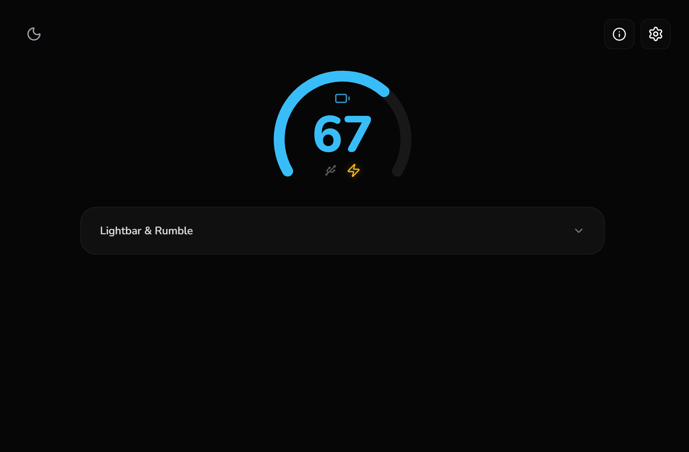
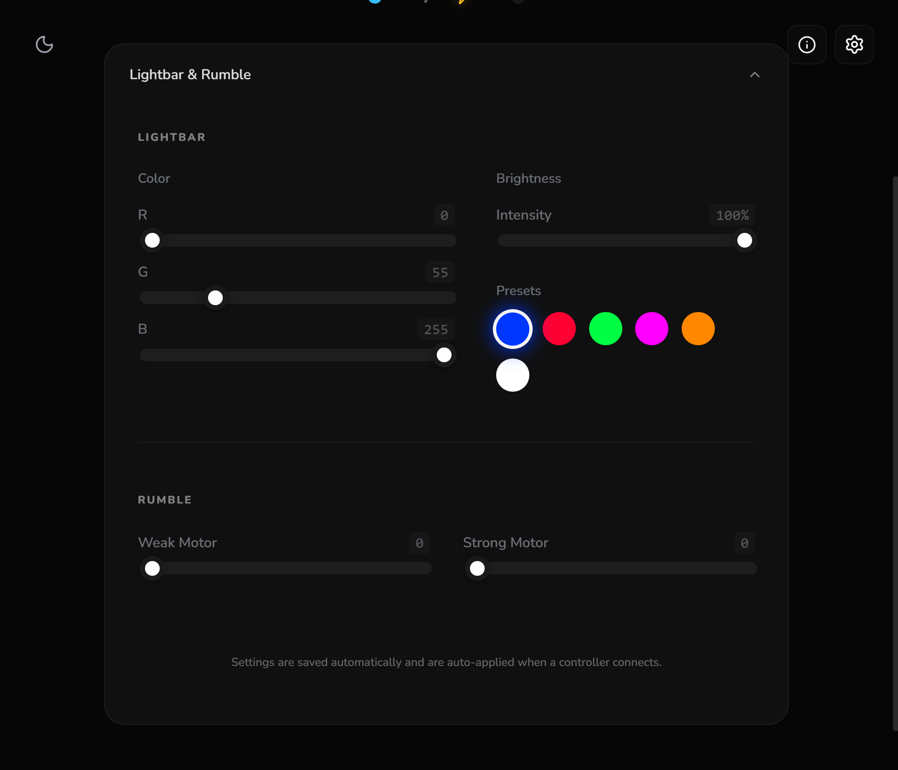
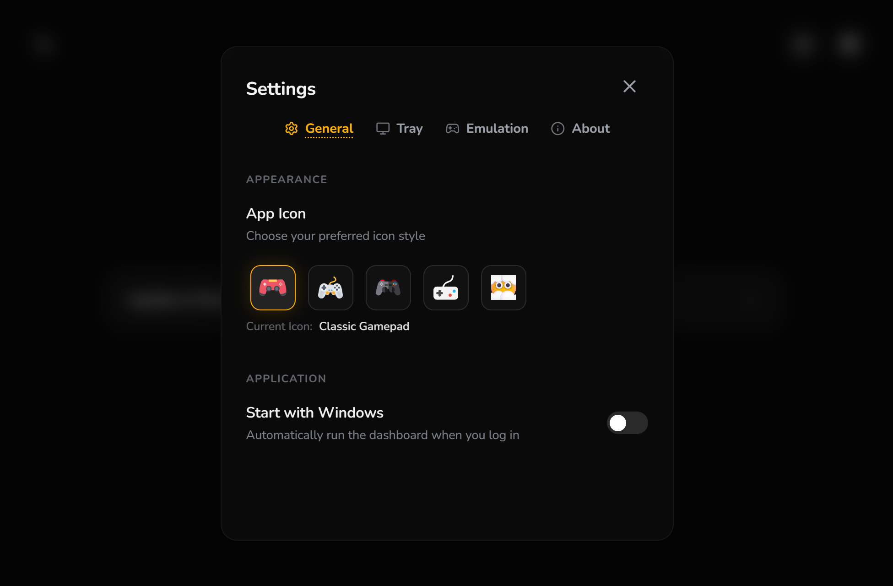
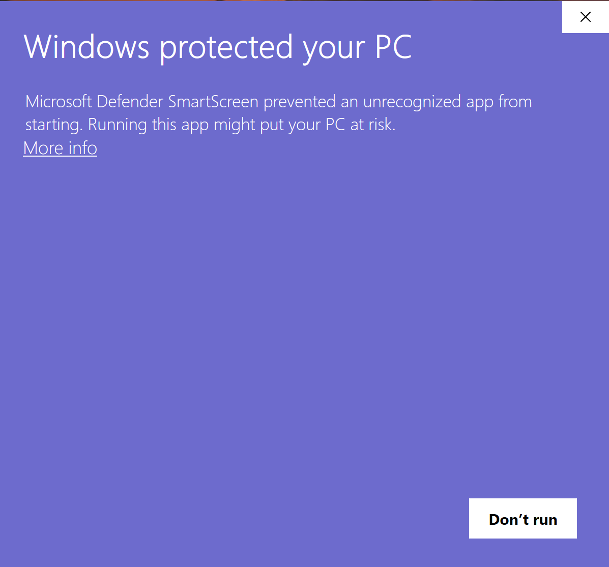
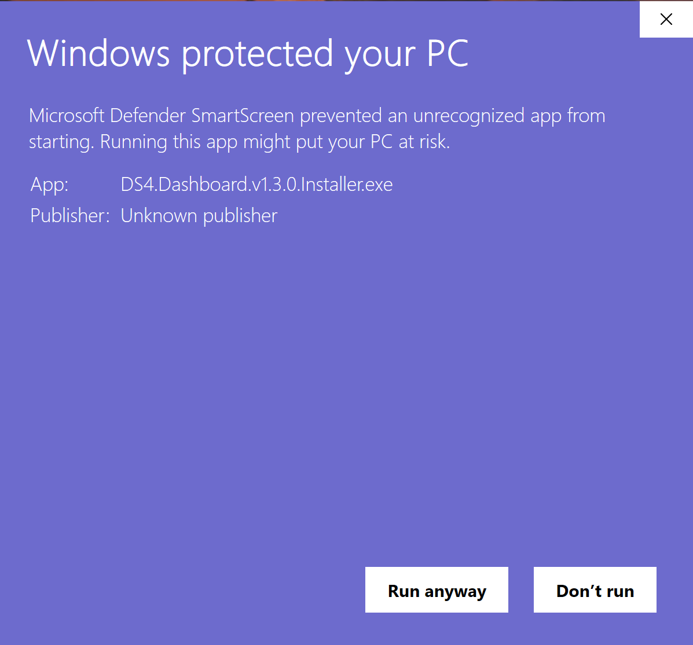

<div align="center">
  <a href='' target="_blank">
    
  </a>
  <h1>DS4 Dashboard</h1>
</div>

- DS4 Dashboard is a lightweight utility for monitoring DualShock 4 controllers on Windows.
- Built with performance and aesthetics in mind using Tauri, Rust, and React.

<br/>

<div align="center">
  
</div>

<br/>

## 🖼️ Showcase

<div align="center">
  <table border="0">
    <tr>
      <td align="center">
        <br/>
        <b>Lightbar & Rumble Control</b>
      </td>
      <td align="center">
        <br/>
        <b>Customization & Icons</b>
      </td>
    </tr>
  </table>
</div>

<br/>

## ✨ Features

- 🎮 **Universal Support**: Full compatibility for both **DualShock 4 v1** and **v2** controllers.
- 🔋 **Real-time Stats**: Instant battery levels, charging states, and connection monitoring.
- 🌈 **Lightbar & Rumble**: Custom color profiles and haptic testing available at any time.
- 🖱️ **Experimental Input**: Translate joystick and touchpad movements to control the mouse cursor (Experimental).
- 🌓 **Dynamic Themes**: Beautiful, minimalist UI with native Dark and Light mode support.
- 🚀 **High Performance**: Lightweight system footprint thanks to Rust and Tauri.
- 📥 **Customizable Tray Gauge**: Optional system tray icon with a clean, gauge-style battery status indicator.

<br/>

## 📥 Downloads
- Grab the [**latest version**](https://github.com/symonxdd/ds4-dashboard/releases/latest) from the Releases page

<br/>

> [!TIP]
> GitHub 'Releases' is GitHub jargon for downloads.

<br/>

<details>
<summary>
<strong>⚠️ What's the "Windows protected the PC" message?</strong>
</summary>

### ⚠️ Windows SmartScreen Warning
When running the app for the first time on Windows, a warning like this might appear:

<div>
  
  <br/><br/>
  
</div>

### 🧠 What's actually happening?

This warning appears because the app is **new** and **hasn't yet built trust** with Microsoft SmartScreen, **not because the app is malicious**.

According to [Microsoft's official documentation](https://learn.microsoft.com/en-us/windows/security/operating-system-security/virus-and-threat-protection/microsoft-defender-smartscreen/), SmartScreen determines whether to show this warning based on:

- Whether the file matches a **known list of malicious apps** or is from a **known malicious site**
- Whether the file is **well-known and frequently downloaded**
- Whether the app is **digitally signed** with a costly trusted certificate

This is **just a generic warning** — many indie or open-source apps trigger it until they build trust or pay for expensive certificates.

### ✅ How to dismiss and run

1. Click **"More info"**
2. Click **"Run anyway"**

### 🤨 Why not prevent the warning

To fully avoid SmartScreen warnings on Windows, developers are expected to:

- Buy and use an **EV (Extended Validation) Code Signing Certificate**  
- Have enough users download the app over time to build a strong **reputation score**

These certificates can cost **hundreds of dollars per year**, which isn't always feasible for solo developers or small open-source projects.  
The focus remains on keeping this tool free and accessible.
  
> For full details on how SmartScreen works, check out [Microsoft's official documentation](https://learn.microsoft.com/en-us/windows/security/operating-system-security/virus-and-threat-protection/microsoft-defender-smartscreen/)

Thanks for supporting open-source software! 💙

</details>

<br/>

## 💡 Motivation

DS4 Dashboard was born out of a simple need: **checking controller battery levels without opening Steam or digging through Windows settings.**

Existing tools for DS4 controllers are often either too complex, outdated, or require heavy background services. A need existed for something:

- **Fast:** Instant startup and minimal resource usage.
- **Modern:** A clean UI that feels at home on Windows 10/11.
- **Focused:** Direct access to core features and information.

DS4 Dashboard provides a focused, high-performance view of the controller's state, leveraging Tauri and Rust for a minimal footprint.

<br/>

## 🗂️ Project Layout
Here's a quick overview of the main files and folders:
```
ds4-dashboard/
├── .github/
│   └── workflows/
│       └── release.yml         # GitHub Actions workflow for automated builds
│
├── crates/
│   └── ds4-hid/                # Low-level HID communication logic in Rust
│
├── scripts/
│   └── release.cjs             # Helper script for versioning and tagging
│
├── src/                        # React frontend (UI)
│   ├── components/             # Dashboard widgets, gauges, and modals
│   ├── context/                # Theme and state management
│   └── App.jsx                 # Main application shell
│
├── src-tauri/                  # Tauri backend (Native bridge)
│   ├── icons/                  # App icons and packaging resources
│   ├── src/                    # Rust backend bindings
│   └── tauri.conf.json         # Tauri project configuration
│
├── package.json                # Node.js dependencies and scripts
└── README.md                   # Current document ✨
```

<br/>

## 🔧 Dev Prerequisites
- To build or run in dev mode, follow the [official Tauri installation guide](https://tauri.app/start/prerequisites/).
- Rust is required, along with **Node.js** and a package manager like `npm`.

<br/>

## ⚙️ Live Development
To start the app in dev mode:
```bash
npm run dev
```

<br/>

## 📦 Release Build
To generate a production-ready installer:
```bash
npm run tauri build
```

<br/>

## 🚀 Release Workflow
DS4 Dashboard uses an automated release pipeline powered by **GitHub Actions** and a helper script.

To create a new release, the release script is executed:
```bash
npm run release
```

This will:
1. Prompt to select the version type (`Patch`, `Minor`, or `Major`)
2. Bump the version in `package.json` & `src-tauri/tauri.conf.json`
3. Commit the changes and create a Git tag
4. Push the commit and tag to GitHub

> [!NOTE]
> The version bump uses a clear commit message like: `chore: bump version to v1.2.3`

When a `v*` tag is pushed, the [`release.yml`](.github/workflows/release.yml) GitHub Actions workflow is triggered.

- 🔧 Builds the production app (Windows).
- 📦 Packages it into an installer (`.exe`).
- 📝 Creates a new GitHub Release and uploads the artifacts.

💡 The release process can be viewed under the repo's **Actions** tab.

<br/>

## Built with ❤️
This project is built with:
- [Tauri](https://tauri.app/)
- [Rust](https://www.rust-lang.org/)
- [React](https://react.dev/)

<div align="center">
  <sub>Made with 💛 by Symon</sub>
</div>
<div align="center">
  <sub>Powered by <a href="https://tauri.app/">Tauri</a></sub>
</div>
